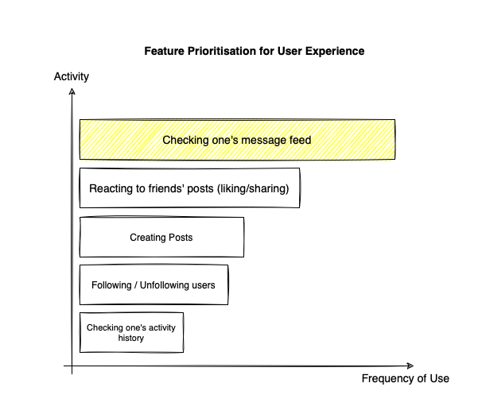
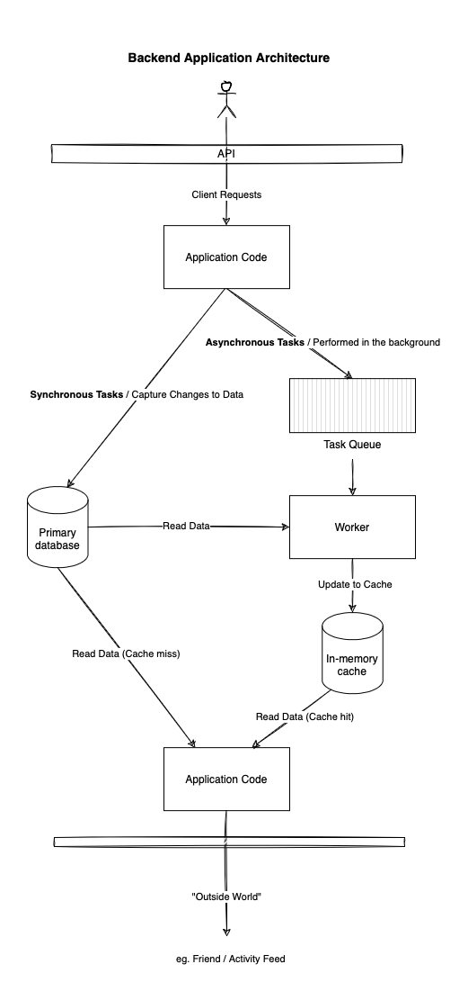
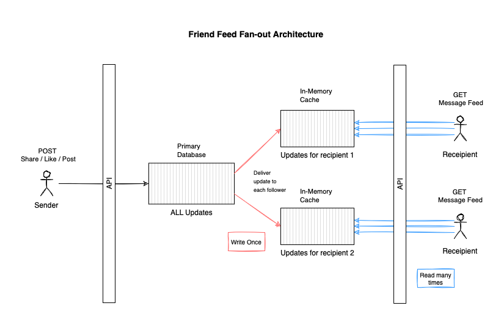
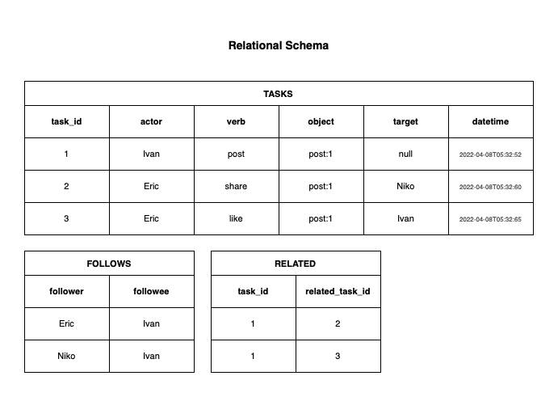
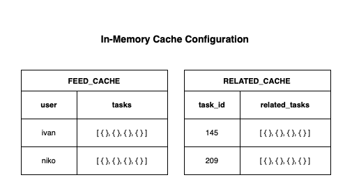

## Horangi Technical Evaluation | 2-9 April'22

# Context

## Purpose
- Design a highly-scalable social network backend.
- Demonstrate the efficacy of the high-level architecture.proposed
- Translate ideas into a working proof-of-concept.

## Outcomes
- Deploy a containerized scalable API backend application.
- It should be easy to get application up and running.
- Built preferably in Python using Python API frameworks.
- Application should meet all proposed requirements in the tech evaluation.
- Automate API endpoint testing with Postman.

## Assumptions
- The names of the `actors` are unique.
- The names of the `objects` are unique references to the underlying content.

# Approach

## Feature Prioritisation

- Disclaimer: the information above is based on personal observation.
- The bar graph above prioritises features based on usage frequency.
- Of the activities above, the reading of message feeds is the most frequently used feature 
- and would thus demand the highest availability.
- This is followed by the creation likes, shares and posts.
- The least used feature is the checking of one's own activity history.

## Application Architecture

- In keeping with the feature prioritisation above, the proposed backend application will comprise of two main flows.
- The first flow is synchronous, these are client requests in which data must be captured in the main relational database. 
- Synchronous tasks include `posts`, `follow`, `shares`, `likes`.
- Each of these tasks would need to be captured in the database to support the asynchronous tasks.
- Asynchronous tasks are concerned with making these updates available to users when they check their feeds.
- This is done by caching the updates ahead of time using the in-memory cache.
- Caching alleviates the need to query the main relational database whenever a user requests a message feed.
- The first asynchronous tasks is message feed `fan-out` which involves delivering a users updates to the user's followers.
- These cached updates are keyed to the follower's name .
- The second type of a synchronous task is the linking of related activity to a specific post in the system.
- These written tasks are written to cache and combined into the message feed when a request takes place.
- This allows each item in the message feed to have a list of related items where applicable.

## Delivery Strategy

- As outlined in the previous section we are designing the application that will scale well and remain highly-available for users checking their message feed.
- The above architecture implements the `write once, read many times` strategy.
- The goal is to extract and cache user-relevant data ahead of time using a `fan-out` process that get scheduled as new updates get added to the main database.

## Database

- The relational database is comprised of three tables.
- The `tasks` table is a record of all activities performed.
- To the system `like`,`shares`,`follows` and `posts` are regarded as a task submitted by the requester to be performed by the system.
- Every `task` is assocated with one actor and one target.
- The target value will be null in the case of a `post`.
- The `follows` table stores a list of users and their followers. 
- This table is referenced during the asynchronous `fan-out` routine.
- The `related` table makes connections between posts and tasks that were submitted in reaction to the post. Each post is associated with 0 to many related tasks.
- For this three-table database to function. It is assumed that the names of the users and objects are unique.

## Caching

- The availability of the message feed feature is relies on caching.
- There are two cache configurations in the system.
- The first configuration is the `feed cache`, this cache stores a list of tasks keyed to a user.
- When a friend feed is requested data is pulled from the feed cache.
- The second configuration is the `related cache`, this cache stores a list of tasks keyed to a `task id`.
- The rationale is that when a related task is added to the database, it is also written to this cache inserting by `task id`.
- Since each `task id` corresponds to a task in the feed cache, it is possible to reference the `related cache` whenever a friend feed is requested to show a list of related activity for a given post.

# Limitations
- A key limitation of this architecture is that it has not been put to the test.
- A limitation that can be anticipated however is the slow speed of the `fan-out` when a user creating a post happens to be a famous or influential figure with followers in the millions or tens of millions. 
- Caching data ahead of time may degrade the system as it performs millions of cache writes.
- A solution to this would be to not wrtie influential users post to the cache right away
- and to implement some hybrid approach of reading from the cache and querying the database when retrieving message feeds.

### Thank you for considering my application 🙂.